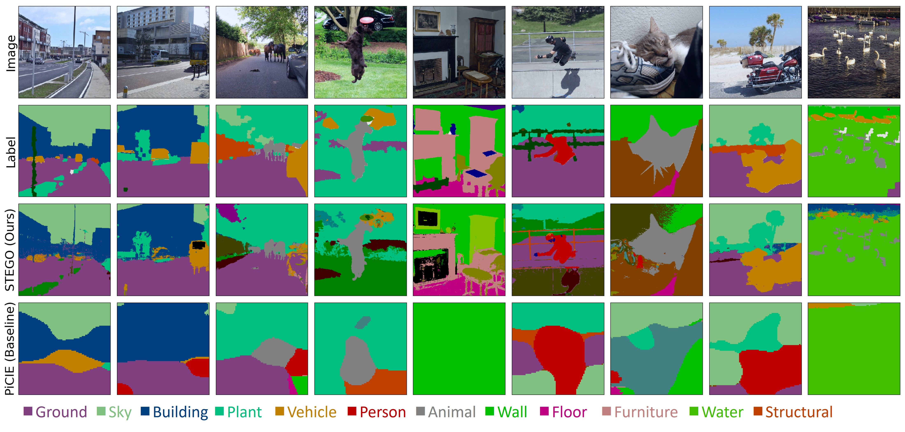

# Analysis of Unsupervised Learning Techniques for Cerebrovascular Image Segmentation
### Authors

- **[Hamza Jad Al Aoun](mailto:jadalaou@eurecom.fr)**
- **[Meriem Driss](mailto:driss@eurecom.fr)**
## STEGO: Unsupervised Semantic Segmentation by Distilling Feature Correspondences
### [Project Page](https://mhamilton.net/stego.html) | [Paper](https://arxiv.org/abs/2203.08414) | [Video](https://aka.ms/stego-video) | [ICLR 2022](https://iclr.cc/virtual/2022/poster/6068) 

	
[Mark Hamilton](https://mhamilton.net/),
[Zhoutong Zhang](https://ztzhang.info/),
[Bharath Hariharan](http://home.bharathh.info/),
[Noah Snavely](https://www.cs.cornell.edu/~snavely/),
[William T. Freeman](https://billf.mit.edu/about/bio)

This is the official implementation of the project "Analysis of Unsupervised Learning Techniques for Cerebrovascular Image Segmentation ".


## Install

### Clone this repository:
```shell script
git clone https://github.com/00casio/STEGO
cd STEGO
```

### Install Conda Environment
Please visit the [Anaconda install page](https://docs.anaconda.com/anaconda/install/index.html) if you do not already have conda installed.
 
Conda might be heavy to be installed on linux so an alternative is to install miniconda from [Moniconda](https://docs.anaconda.com/miniconda/miniconda-install/)

To setup the environment you need to run the following commands:
```shell script
conda env create -f environment.yml
conda activate stego
```
If it is the case where conda is not known as an internal command, it is better to access conda from its files where its installed as follows 
```
source ~/miniconda3/bin/activate stego1
```


### Download Pre-Trained Models

```shell script
cd src
python download_models.py
```
## Training

To train STEGO from scratch, put the dataset in the dataset folder, name the dataset as potsdam and make sure that it has two folders, one named gt and one named imgs with 3 txt files, first one is all.txt having all the images names without their extensions, labelled_test.txt having the name of the testing (validation) images, labelled_train.txt having the training images, and unlabelled_train.txt this could be empty.
If you encounter any errors, you need to check train_config.yml in configs.

The labels can be changed to .mat with changing their gray scale 255 to 1 with the code fix_label_pixel.py.
Note that gt and imgs should have the same names regardless of their extensions.
The structure of the dataset should be as follows:

```
dataset
|
|──potsdam
      |
      └── imgs
      |   |──unique_img_name_1.png
      |   └──unique_img_name_2.png     
      └── gt
      |   |──unique_img_name_1.mat
      |   └──unique_img_name_2.mat
      |
      └── all.txt
      |
      └── labelled_train.txt
      |
      └── labelled_test.txt
      |
      └── unlabelled_train.txt 
   

```

```shell script
python crop_datasets.py
python precompute_knns.py
```

Then you can run the following in `STEGO/src`:
```shell script
python train_segmentation.py
```
Hyperparameters can be adjusted in [`STEGO/src/configs/train_config.yml`](src/configs/train_config.yml)

To monitor training with tensorboard run the following from `STEGO` directory:

```shell script
tensorboard --logdir ../../output/logs
```

## Reconstruction of Predicted Vessels

This section details the **Volume Reconstruction** process using a pre-trained Stego model. The goal is to reconstruct 3D volumes and evaluate segmentation performance with metrics like Dice and clDice.
#### 1. Data Preparation
- Load the test dataset and its corresponding labels.
- Ensure the number of input files matches the number of label files.
- Apply necessary preprocessing steps like skull stripping and standardization.
#### 2. Model Initialization
- Initialize the Stego model with a checkpoint file "/path/to/checkpoint.ckpt"

#### 3. Prediction

For each volume:
- Load the volume and iterate over each slice.
- Extract patches from the slice and preprocess them:
- Use the Stego model to predict the segmentation for each patch:
- Apply any necessary post-processing steps, such as thresholding, to the predicted patches.

#### 4. Reconstruction
Reconstruct the entire volume from the predicted slices:
Assemble the predicted slices into a 3D volume.
Save the reconstructed volume for further analysis and visualization.

#### 5. Evaluation
Compute evaluation metrics for the reconstructed volumes:
Dice Score: Measures overlap between predicted and ground truth labels.
clDice Score: Measures the similarity between the predicted and ground truth binary masks.
The results are saved in a text file, typically named evaluation_results.txt, which contains metrics for each dataset configuration.

#### Example usage:
```bash
python volume_reconstruction.py --dataset_name <DATASET_NAME> --n_size <SIZE> --current_seed <SEED>
```
## Understanding STEGO

### Unsupervised semantic segmentation
Real-world images can be cluttered with multiple objects making classification feel arbitrary. Furthermore, objects in the real world don't always fit in bounding boxes. Semantic segmentation methods aim to avoid these challenges by assigning each pixel of an image its own class label. Conventional semantic segmentation methods are notoriously difficult to train due to their dependence on densely labeled images, which can take 100x longer to create than bounding boxes or class annotations. This makes it hard to gather sizable and diverse datasets impossible in domains where humans don't know the structure a-priori. We sidestep these challenges by learning an ontology of objects with pixel-level semantic segmentation through only self-supervision.

### Deep features connect objects across images
Self-supervised contrastive learning enables algorithms to learn intelligent representations for images without supervision. STEGO builds on this work by showing that representations from self-supervised visual transformers like  Caron et. al.’s  DINO are already aware of the relationships between objects. By computing the cosine similarity between image features, we can see that similar semantic regions such as grass, motorcycles, and sky are “linked” together by feature similarity.


### The STEGO architecture
The STEGO unsupervised segmentation system learns by distilling correspondences between images into a set of class labels using a contrastive loss. In particular we aim to learn a segmentation that respects the induced correspondences between objects. To achieve this we train a shallow segmentation network on top of the DINO ViT backbone with three contrastive terms that distill connections between an image and itself, similar images, and random other images respectively. If two regions are strongly coupled by deep features we encourage them to share the same class.


### Results

We evaluate the STEGO algorithm on the CocoStuff, Cityscapes, and Potsdam semantic segmentation datasets. Because these methods see no labels, we use a Hungarian matching algorithm to find the best mapping between clusters and dataset classes. We find that STEGO is capable of segmenting complex and cluttered scenes with much higher spatial resolution and sensitivity than the prior art, [PiCIE](https://sites.google.com/view/picie-cvpr2021/home). This not only yields a substantial qualitative improvement, but also more than doubles the mean intersection over union (mIoU). For results on Cityscapes, and Potsdam see [our paper](https://arxiv.org/abs/2203.08414).




## Citation

```
@inproceedings{hamilton2022unsupervised,
	title={Unsupervised Semantic Segmentation by Distilling Feature Correspondences},
	author={Mark Hamilton and Zhoutong Zhang and Bharath Hariharan and Noah Snavely and William T. Freeman},
	booktitle={International Conference on Learning Representations},
	year={2022},
	url={https://openreview.net/forum?id=SaKO6z6Hl0c}
}
```

## Contact

For feedback or questions, please contact jadalaou@eurecom.fr or driss@eurecom.fr

